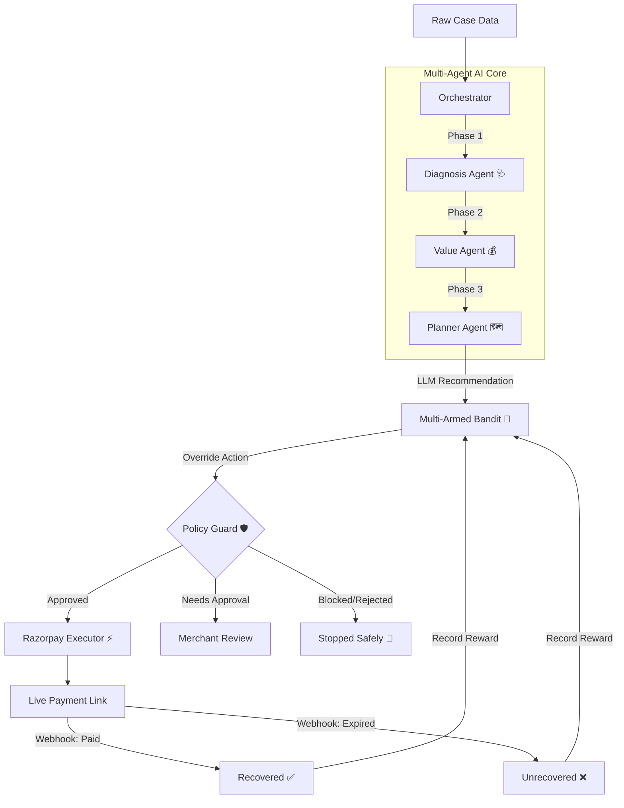

<div align="center">
  
  <h1>RevivePay</h1>
  <p><strong>An Autonomous AI Recovery Desk for Payments at Risk</strong></p>

  [](https://fastapi.tiangolo.com/)
  [](https://reactjs.org/)
  [](https://www.mongodb.com/)
  [](https://ai.google.dev/)
  [](https://razorpay.com/)
</div>

---

## 📖 Overview

Revenue loss rarely happens in one clean step. A payment degrades, a checkout gets abandoned, a subscription fails, or an invoice goes overdue. **RevivePay** is a multi-agent AI system that closes the loop from detecting the problem to diagnosing it, choosing the right intervention, and actually recovering the money using real-world payment links.

Rather than just identifying problems, RevivePay executes a **bounded recovery workflow**—processing batches of failed transactions, enforcing strict policy guardrails, and outputting measurable net-recovery metrics with a fully compliant audit trail. A built-in **Multi-Armed Bandit** learns from every outcome and gradually shifts towards the actions that actually recover the most money.

---

## ✨ Key Features

- **Multi-Agent Diagnostics:** Uses a network of highly specialized LLMs (Google Gemini) to contextually diagnose payment failures and evaluate customer Lifetime Value (LTV).
- **Automated Negotiation & Interventions:** Autonomously generates customized intervention plans, including strategically calculated discount tiers (3%, 5%, 8%).
- **Multi-Armed Bandit (ε-Greedy):** A data-driven learning system that overrides the LLM's action choice with empirically proven best actions per failure type, while preserving the AI's reasoning in a clean audit trail.
- **A/B Comparison Engine:** Runs identical synthetic cases through a static rulebook ("Fixed Rules") and the learning bandit side-by-side to produce a concrete, provable claim — _"the learning system recovered X% more than a static rulebook."_
- **Strict Policy Guardrails:** A deterministic rule engine intercepts the AI's plan to enforce maximum contact caps, minimum recovery thresholds, discount ceilings (up to 8%), and consent compliance.
- **Live Razorpay Integration:** Dynamically generates real Razorpay payment links (standard or discounted) based on the AI's final approved plan.
- **Net Recovery Reporting:** Tracks and subtracts the cost of discounts and outreach, reporting honest gross vs. net recovery metrics on a beautiful dashboard.
- **Threshold Sweep Engine:** Automated experiment harness that tests hundreds of policy parameter combinations in-memory to find the optimal ruleset that maximizes net recovery, with one-click application to the live system.

---

## 🧠 Architecture & Workflow

RevivePay's core engine is built on an orchestrated pipeline of specialized AI agents, a learning bandit, and a deterministic policy guard.



### The Agents
1. **Diagnosis Agent 🩺**: Analyzes raw failure codes (e.g., `insufficient_funds`, `checkout_abandoned`) to classify the root cause into one of 6 failure types.
2. **Value Agent 💰**: Assesses customer history, cart value, and intent to calculate recovery priority.
3. **Planner Agent 🗺️**: Synthesizes the diagnosis and value assessment to propose one of 7 recovery actions: `CREATE_PAYMENT_LINK`, `SEND_REMINDER`, `OFFER_DISCOUNT_3`, `OFFER_DISCOUNT_5`, `OFFER_DISCOUNT_8`, `ESCALATE_TO_HUMAN`, or `DO_NOT_CONTACT`.
4. **Multi-Armed Bandit 🎰**: Overrides the LLM's action choice with the empirically best-performing action for that failure type. Uses an ε-greedy algorithm (ε decays from 0.4 → 0.05) so it keeps exploring early and gradually locks onto winners. The LLM's original recommendation and the bandit's override reasoning are both preserved in the audit trail.
5. **Policy Guard 🛡️**: The deterministic safety layer. It strictly verifies the plan against hardcoded rules (e.g., max contact attempts, explicit consent required, discount ceiling at 8%) before execution.

---

## 📈 Threshold Sweep & Optimization

Instead of guessing the right policy thresholds (like "max 3 retries" or "discounts capped at 8%"), RevivePay includes a built-in **Threshold Sweep Engine**.

1. **Test Hundreds of Combinations:** The engine systematically evaluates ~264 combinations of policy parameters against your batch of cases in-memory.
2. **Find the Winner:** It ranks every combination by projected **Net Recovered Amount** (Gross minus Discount and Contact costs).
3. **Apply & Compare:** With one click, apply the winning thresholds to the live Policy Guard. Re-run your batch to generate a real-world Before & After comparison showing the exact revenue improvement.

---

## 🎰 Multi-Armed Bandit & A/B Comparison

The bandit learns which recovery action works best for each type of payment failure by tracking real outcomes.

### How It Works
- **Arms:** 6 actions × 6 failure classes = 36 independent arms, each with a running average reward.
- **Reward Signal:** `net_recovered / amount` — normalized to [0, 1]. A case that recovers ₹15,000 with a ₹300 discount = reward of 0.98. An unrecovered case = 0.
- **Exploration Decay:** Starts at 40% random exploration, decays to 5% as data accumulates.
- **Override, Not Advise:** The bandit overrides the LLM's action choice, not its reasoning. Both are preserved in the audit trail.

### A/B Comparison
The comparison engine generates identical synthetic cases and runs them through:
1. **Fixed Rules** — a static mapping (e.g., `insufficient_funds → PAYMENT_LINK`, `expired_card → REMINDER`)
2. **Bandit** — an in-memory ε-greedy learner that improves as it processes cases

No database writes, no LLM calls. Results include a learning curve chart, per-failure breakdown, and a concrete improvement metric.

**Verified result (200 cases):**
| | Fixed Rules | Bandit | Δ |
|---|---|---|---|
| Net Recovered | ₹5,86,732 | ₹16,83,790 | **+₹10,97,058** |
| Recovery Rate | 20.0% | 61.0% | **+41pp** |
| Improvement | — | — | **+187%** |

Run the CLI verification:
```bash
cd backend
source venv/bin/activate
python -m app.bandit.verify_bandit
```

---

## 💻 Tech Stack

### Backend
- **Framework:** FastAPI (Python 3.11+)
- **Database:** MongoDB (Motor Async, Beanie ODM)
- **AI Integration:** Google Gemini SDK (`gemini-3.5-flash-lite`, `gemini-3.1-flash-lite`)
- **Payments:** Razorpay API
- **Learning:** Custom ε-Greedy Multi-Armed Bandit

### Frontend
- **Framework:** React + Vite
- **Styling:** Tailwind CSS
- **Charts:** Custom SVG (learning curves, bar charts)

---

## 🗂️ Project Structure

```
RevivePay/
├── backend/
│   ├── app/
│   │   ├── agents/           # LLM agents (diagnosis, value, planner)
│   │   ├── bandit/           # Multi-Armed Bandit engine + A/B comparison
│   │   ├── data/             # Demo fixtures & synthetic data generator
│   │   ├── execution/        # Razorpay & simulated executors
│   │   ├── models/           # Beanie ODM models (Case, BanditArm)
│   │   ├── orchestrator/     # Core pipeline orchestrator
│   │   ├── policy/           # Deterministic policy guard
│   │   ├── routers/          # FastAPI route handlers
│   │   ├── sweep/            # Threshold sweep engine
│   │   └── utils/            # Seeded RNG, Gemini client
│   └── requirements.txt
├── frontend/
│   └── src/
│       ├── api/              # API client
│       └── components/       # React dashboard components
│           ├── ABComparison.jsx
│           ├── ApprovalQueue.jsx
│           ├── BanditDashboard.jsx
│           ├── BatchRunProgress.jsx
│           ├── CaseDetailTrace.jsx
│           ├── CaseTable.jsx
│           ├── SummaryCard.jsx
│           └── ThresholdSweep.jsx
└── README.md
```

---

## 🚀 Getting Started

### 1. Prerequisites
- Node.js (v18+)
- Python (3.11+)
- MongoDB Atlas Cluster (or local instance)
- Razorpay Test Credentials
- Google Gemini API Key

### 2. Backend Setup
Navigate to the `backend` directory, create a virtual environment, and install dependencies:
```bash
cd backend
python -m venv venv
source venv/bin/activate  # On Windows: venv\Scripts\activate
pip install -r requirements.txt
```

Set up your environment variables by copying the example file:
```bash
cp .env.example .env
```
*(Make sure to add your MongoDB URI, Gemini API Keys, and Razorpay credentials to the `.env` file).*

Start the FastAPI server:
```bash
uvicorn app.main:app --reload --port 5000
```

### 3. Frontend Setup
Open a new terminal, navigate to the `frontend` directory, and start the Vite dev server:
```bash
cd frontend
npm install
npm run dev
```

### 4. Running a Live Recovery Batch
1. **Seed the Database:** Run `python app/data/generate_synthetic_data.py` from the `backend` directory to seed the database with 8 live demo cases.
2. **Launch Dashboard:** Open `http://localhost:3000` in your browser.
3. **Execute AI Agents:** Click **"Run Batch"**. Watch the AI agents diagnose, evaluate, plan, and pass/block the cases in real-time.
4. **Pay & Recover:** Click on an "Approved" case to view the audit trail, grab the generated Razorpay link, and pay it live to watch the Net Recovery metrics update!

### 5. Verify the Bandit
Run the A/B comparison harness to prove the bandit outperforms static rules:
```bash
cd backend
source venv/bin/activate
python -m app.bandit.verify_bandit
```
Or use the **Bandit → A/B Comparison** tab in the dashboard to run it visually.
