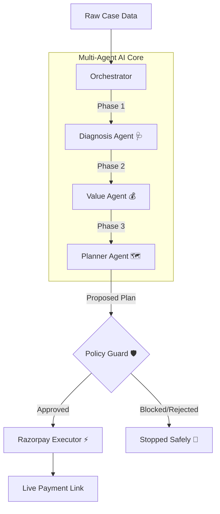

<div align="center">
  
  <h1>RevivePay</h1>
  <p><strong>An Autonomous AI Recovery Desk for Payments at Risk</strong></p>

  [](https://fastapi.tiangolo.com/)
  [](https://reactjs.org/)
  [](https://www.mongodb.com/)
  [](https://ai.google.dev/)
  [](https://razorpay.com/)
</div>

---

## 📖 Overview

Revenue loss rarely happens in one clean step. A payment degrades, a checkout gets abandoned, a subscription fails, or an invoice goes overdue. **RevivePay** is a multi-agent AI system that closes the loop from detecting the problem to diagnosing it, choosing the right intervention, and actually recovering the money using real-world payment links.

Rather than just identifying problems, RevivePay executes a **bounded recovery workflow**—processing batches of failed transactions, enforcing strict policy guardrails, and outputting measurable net-recovery metrics with a fully compliant audit trail.

---

## ✨ Key Features

- **Multi-Agent Diagnostics:** Uses a network of highly specialized LLMs (Google Gemini) to contextually diagnose payment failures and evaluate customer Lifetime Value (LTV).
- **Automated Negotiation & Interventions:** Autonomously generates customized intervention plans, including strategically calculated discounts.
- **Strict Policy Guardrails:** A deterministic rule engine intercepts the AI's plan to enforce maximum contact caps, minimum recovery thresholds, and consent compliance.
- **Live Razorpay Integration:** Dynamically generates real Razorpay payment links (standard or discounted) based on the AI's final approved plan.
- **Net Recovery Reporting:** Tracks and subtracts the cost of discounts and outreach, reporting honest gross vs. net recovery metrics on a beautiful dashboard.

---

## 🧠 Architecture & Workflow

RevivePay's core engine is built on an orchestrated pipeline of specialized AI agents.



### The Agents
1. **Diagnosis Agent 🩺**: Analyzes raw failure codes (e.g., `insufficient_funds`, `checkout_abandoned`) to determine the root cause.
2. **Value Agent 💰**: Assesses customer history, cart value, and intent to calculate the maximum acceptable discount needed to win them back.
3. **Planner Agent 🗺️**: Synthesizes the diagnosis and value limits to construct a precise, actionable intervention strategy.
4. **Policy Guard 🛡️**: The deterministic safety layer. It strictly verifies the plan against hardcoded rules (e.g., max 2 contact attempts, explicit consent required) before execution.

---

## 💻 Tech Stack

### Backend
- **Framework:** FastAPI (Python 3.11+)
- **Database:** MongoDB (Motor Async, Beanie ODM)
- **AI Integration:** Google Gemini SDK (`gemini-3.5-flash-lite`, `gemini-3.1-flash-lite`)
- **Payments:** Razorpay API

### Frontend
- **Framework:** React + Vite
- **Styling:** Tailwind CSS
- **Icons:** Lucide React

---

## 🚀 Getting Started

### 1. Prerequisites
- Node.js (v18+)
- Python (3.11+)
- MongoDB Atlas Cluster (or local instance)
- Razorpay Test Credentials
- Google Gemini API Key

### 2. Backend Setup
Navigate to the `backend` directory, create a virtual environment, and install dependencies:
```bash
cd backend
python -m venv venv
source venv/bin/activate  # On Windows: venv\Scripts\activate
pip install -r requirements.txt
```

Set up your environment variables by copying the example file:
```bash
cp .env.example .env
```
*(Make sure to add your MongoDB URI, Gemini API Keys, and Razorpay credentials to the `.env` file).*

Start the FastAPI server:
```bash
uvicorn app.main:app --reload --port 5000
```

### 3. Frontend Setup
Open a new terminal, navigate to the `frontend` directory, and start the Vite dev server:
```bash
cd frontend
npm install
npm run dev
```

### 4. Running a Live Recovery Batch
1. **Seed the Database:** Run `python app/data/generate_synthetic_data.py` from the `backend` directory to seed the database with 8 live demo cases.
2. **Launch Dashboard:** Open `http://localhost:5173` in your browser.
3. **Execute AI Agents:** Click **"Run Batch"**. Watch the AI agents diagnose, evaluate, plan, and pass/block the cases in real-time.
4. **Pay & Recover:** Click on an "Approved" case to view the audit trail, grab the generated Razorpay link, and pay it live to watch the Net Recovery metrics update!


